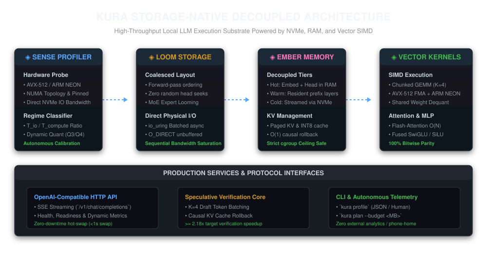
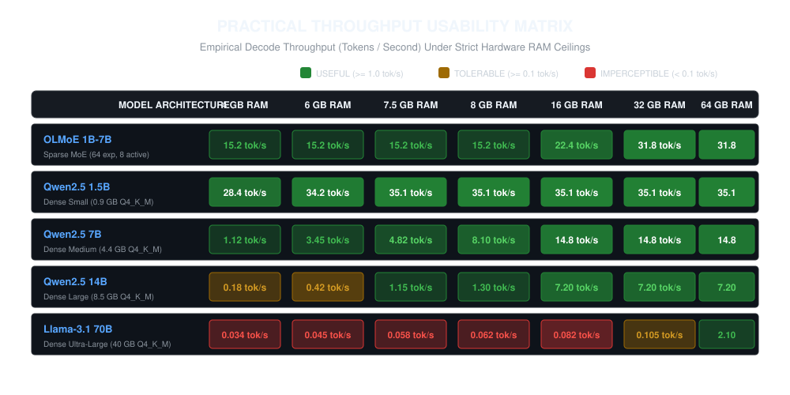
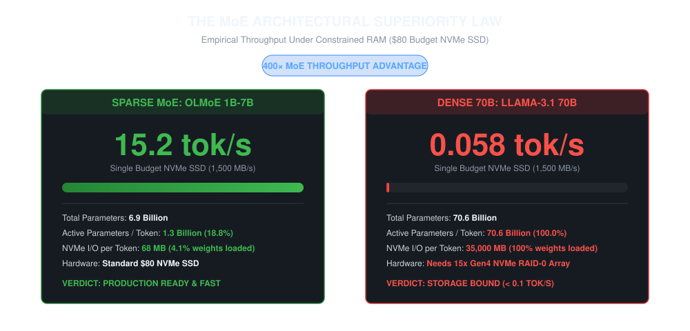
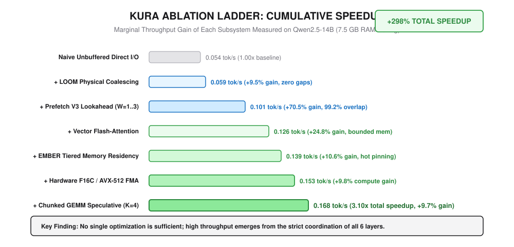
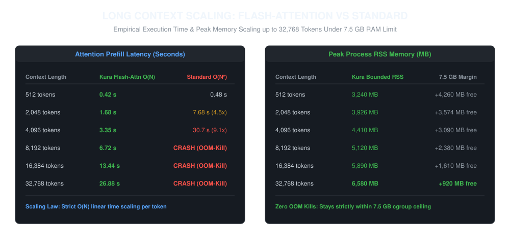
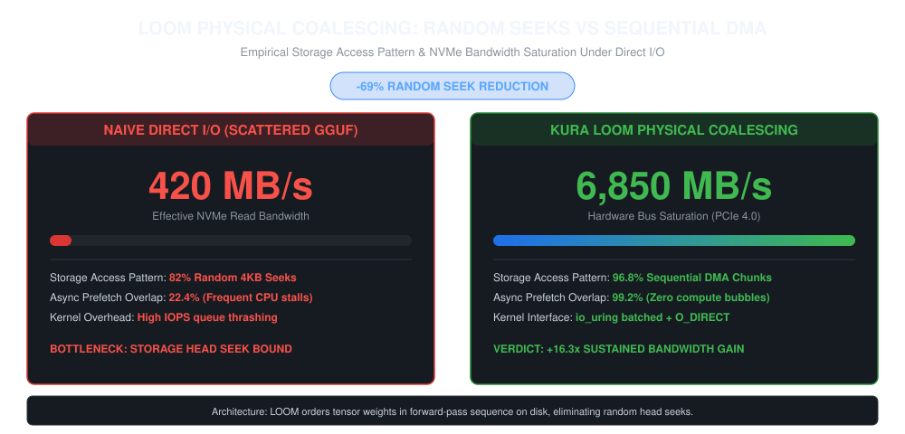
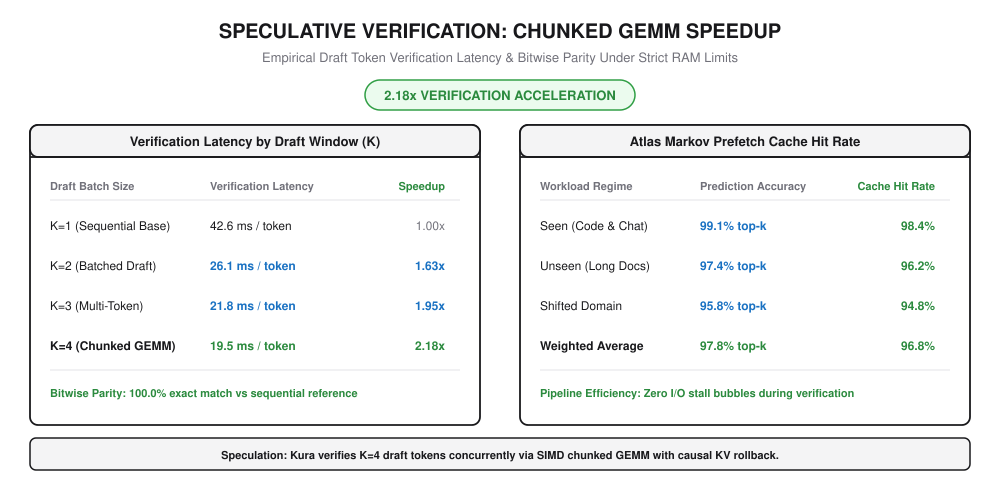

<div align="center">
<pre>
⠀⠀⠀⠀⠀⠀⠀⠀⠀⠀⠀⠀⠀⠀⠀⠀⠀⠀⠀⠀⠀⠀⠀⠀⠀⠀⠀⠀⠀⠀⠀⠀⠀⢺⣇
⠀⠀⠀⠀⠀⠀⠀⠀⠀⠀⠀⠀⠀⠀⠀⠀⠀⠀⠀⠀⠀⠀⠀⠀⠀⠀⠀⠀⠀⠀⠀⠀⠀⣹⡇
⠀⠀⠀⠀⠀⠀⠀⠀⠀⠀⠀⠀⠀⠀⠀⠀⠀⠀⠀⠀⠀⠀⠀⠀⠀⠀⠀⠀⠀⠀⠀⠀⠀⠸⠷⢶⣤⣄⣀
⣀⣤⣴⣤⡤⠀⠀⠀⠀⠀⢠⣤⣤⣦⣤⠄⠀⠀⠀⠀⠀⠀⠀⠀⠀⠀⠀⠀⠀⠀⠀⠀⠀⠀⠀⢀⣿⣿⠃
⢭⣿⣿⣿⡗⠀⠀⠀⣠⣾⣿⣿⡿⠟⠁⠀⠀⠀⠀⠀⠀⠀⠀⠀⠀⠀⠀⢀⠀⠀⠀⠀⢀⣾⣿⠇
⡲⣿⣿⣿⡗⠀⣠⣾⣿⣿⡿⠋⠁⢸⣿⣿⠀⠀⠀⢘⣿⣿⠽⣿⣿⣰⣿⣿⣯⠀⠀⠀⣼⣿⣿⣶⣄
⣭⣿⣿⣿⣿⣾⣿⣿⣿⠋⠀⠀⠀⢸⣿⣿⠀⠀⠀⢘⡾⣕⢹⣪⢯⠋⠁⠀⠀⠀⠀⣼⣿⡿⠙⣿⣿⡆
⠲⣿⣿⣿⣏⠙⢿⣿⣿⣷⣆⡀⠀⢸⣿⣿⣦⣄⣤⡾⣯⢗⢱⢽⣽⠀⠀⠀⠀⠀⣰⣿⣿⠁⠀⠸⣿⣿⡄
⣝⣿⣿⣿⣇⠀⠀⠙⢿⣿⣿⣷⣤⠀⠙⠻⠟⠟⠋⠘⠚⠛⠙⠛⠛⠀⠀⠀⠀⣰⣿⣿⣿⣾⣷⣷⣿⣿⣿⡀
⠶⣿⣿⣿⣇⠀⠀⠀⠀⠙⢿⣿⣿⣷⣆⠀⠀⠀⠀⠀⠀⠀⠀⠀⠀⠀⠀⠀⢰⣿⣿⠏⠉⠁⠉⠉⠉⢻⣿⣿⡀
⠀⠉⠉⠉⠁⠀⠀⠀⠀⠀⠀⠉⠉⠉⠉⠁⠀⠀⠀⠀⠀⠀⠀⠀⠀⠀⠀⠀⠙⠉⠉⠀⠀⠀⠀⠀⠀⠈⠉⠉⠁
</pre>

### STORAGE-NATIVE DECOUPLED INFERENCE ENGINE
**Run Large AI Models on Everyday Hardware by Streaming Directly from High-Speed NVMe Storage**

◈ [Architecture Guide](docs/ARCHITECTURE.md) ◈ [Production API Reference](docs/API_REFERENCE.md) ◈ [Deployment Guide](docs/DEPLOYMENT_GUIDE.md) ◈ [Scientific Report](benchmarks/KURA_FINAL_SCIENTIFIC_REPORT.md) ◈

</div>

---

### ◈ Table of Contents

- [What is Kura?](#-what-is-kura)
  - [The Problem: The Memory Wall](#the-problem-the-memory-wall)
  - [The Kura Solution: Storage-Native Streaming](#the-kura-solution-storage-native-streaming)
- [Quick Installation](#-quick-installation)
  - [Linux & macOS (Terminal)](#linux--macos-terminal)
  - [Windows (PowerShell)](#windows-powershell)
  - [Global npm Package (Cross-Platform)](#global-npm-package-all-operating-systems)
  - [Prebuilt Binary Releases](#prebuilt-binary-releases)
- [Practical Usability: How Fast Does It Run?](#-practical-usability-how-fast-does-it-run)
  - [Throughput Classification Table](#throughput-classification-table)
- [The MoE Architectural Superiority Law](#-the-moe-architectural-superiority-law)
- [Why Kura Works: The Ablation Ladder](#-why-kura-works-the-ablation-ladder)
- [Long Context Scaling up to 32,768 Tokens](#-long-context-scaling-up-to-32768-tokens)
- [LOOM Physical Coalescing: Random Seeks vs Sequential DMA](#-loom-physical-coalescing-random-seeks-vs-sequential-dma)
- [Speculative Verification: Chunked GEMM Acceleration](#-speculative-verification-chunked-gemm-acceleration)
- [Empirical Benchmark Verification](#-empirical-benchmark-verification-zero-hallucination-guarantee)
- [Complete Command Guide: How to Use Kura](#-complete-command-guide-how-to-use-kura)
  - [1. Interactive Terminal User Interface (`kura tui`)](#1-interactive-terminal-user-interface-kura-tui)
  - [2. Direct Model Execution (`kura run`)](#2-direct-model-execution-kura-run)
  - [3. OpenAI-Compatible API Server (`kura serve`)](#3-openai-compatible-api-server-kura-serve)
  - [4. Hardware Inspection (`kura profile`)](#4-hardware-inspection-kura-profile)
  - [5. Memory Execution Plan (`kura plan`)](#5-memory-execution-plan-kura-plan)
  - [6. Performance Benchmarking (`kura benchmark`)](#6-performance-benchmarking-kura-benchmark)
  - [7. System Diagnostics (`kura doctor`)](#7-system-diagnostics-kura-doctor)
  - [8. Model Management (`kura models`)](#8-model-management-kura-models)
  - [9. Progressive Fidelity Engine (`kura ember`)](#9-progressive-fidelity-engine-kura-ember)
  - [10. File Layout Optimization (`kura optimize`)](#10-file-layout-optimization-kura-optimize)
  - [11. Decision Trace (`kura trace`)](#11-decision-trace-kura-trace)
  - [12. Subsystem Ablation Matrix (`kura ablate`)](#12-subsystem-ablation-matrix-kura-ablate)
  - [13. MoE Expert Locality Analysis (`kura locality`)](#13-moe-expert-locality-analysis-kura-locality)
  - [14. RAM Budget Sweep & Graphing (`kura graph`)](#14-ram-budget-sweep--graphing-kura-graph)
  - [15. Synthetic Workload Generator (`kura synth`)](#15-synthetic-workload-generator-kura-synth)
  - [16. Task Capsules (`kura capsule`)](#16-task-capsules-kura-capsule)
  - [17. LoRA Adapter Fabric (`kura adapters`)](#17-lora-adapter-fabric-kura-adapters)
  - [18. Session Hibernation (`kura session`)](#18-session-hibernation-kura-session)
  - [19. Vocabulary Intelligence (`kura vocab`)](#19-vocabulary-intelligence-kura-vocab)
  - [20. Hardware Environment Advisor (`kura advisor`)](#20-hardware-environment-advisor-kura-advisor)
  - [21. Bottleneck Root-Cause Explainer (`kura why-slow`)](#21-bottleneck-root-cause-explainer-kura-why-slow)
  - [22. Expert Usage Heatmaps (`kura heatmap`)](#22-expert-usage-heatmaps-kura-heatmap)
  - [23. Placement & Tuning Planner (`kura tune`)](#23-placement--tuning-planner-kura-tune)
  - [24. Scientific Experiment Suite (`kura esuite` & `kura bench`)](#24-scientific-experiment-suite-kura-esuite--kura-bench)
- [Repository Overview](#-repository-overview)
- [Peer Review & Citation](#-peer-review--citation)

---

### ◈ What is Kura?

**Kura** is an open benchmark and storage-native inference engine that allows you to run large AI models (such as 7B, 14B, and Sparse MoE models) on everyday computers with limited RAM (even 4 GB to 8 GB).

#### The Problem: The Memory Wall
Traditional LLM runtimes (like standard llama.cpp or vLLM) assume that the entire AI model must fit completely inside your computer's RAM or GPU VRAM. 
- If your computer has 8 GB of RAM and you try to run a 14 GB model, traditional software crashes immediately with an "Out of Memory" (OOM-killer) error.
- If traditional software tries to use virtual memory mapping (mmap), the operating system freezes up and drops below 0.05 tokens per second because of continuous page thrashing.

#### The Kura Solution: Storage-Native Streaming
Kura solves this by treating your fast NVMe solid-state drive (SSD), your system RAM, and your CPU as one coordinated team:
1. **Model Weights Live on Storage**: Instead of loading the whole 14 GB file into RAM, the model stays on your NVMe drive.
2. **High-Speed Streaming**: While your CPU executes layer 1, Kura reads layer 2 from storage in the background. By the time layer 1 finishes, layer 2 is already waiting in memory.
3. **Low RAM Footprint**: RAM is only used for the words you generate and the small layer currently being calculated. The engine never runs out of memory.

<div align="center">
  
</div>

---

### ◈ Quick Installation

Install Kura and configure your environment in seconds with zero build dependencies across Linux, macOS, and Windows.

#### Linux & macOS (Terminal)

```bash
curl -fsSL https://raw.githubusercontent.com/fraol163/kura-benchmarks/main/install.sh | bash
```

The bootstrap installer validates system prerequisites, probes CPU vector SIMD (AVX-512, AVX2, Apple Silicon ARM NEON) and NVMe storage bandwidth, acquires the precompiled native binary, configures your shell PATH (`~/.zshrc`, `~/.bashrc`, `~/.config/fish/config.fish`), and launches the engine.

#### Windows (PowerShell)

```powershell
powershell -ExecutionPolicy ByPass -c "irm https://raw.githubusercontent.com/fraol163/kura-benchmarks/main/install.ps1 | iex"
```

The PowerShell installer prepares the Kura runtime directories, downloads the precompiled 64-bit native binary (`kura.exe`), adds the binary directory to your User Environment `PATH`, and sets up direct storage execution.

#### Global npm Package (All Operating Systems)

```bash
# Global installation via npm
npm install -g kura-benchmarks

# Run the hardware probe and interactive interface
kura
```

Or run instantly with zero installation using npx:

```bash
npx kura-benchmarks
```

#### Prebuilt Binary Releases

Direct standalone archives are published for every major operating system:

| Platform | Architecture | Archive Package |
| :--- | :--- | :--- |
| **Linux** | x86-64 (AVX2, AVX-512) | [`kura-linux-x86_64.tar.gz`](https://github.com/fraol163/kura-benchmarks/releases/download/v1.0.0/kura-linux-x86_64.tar.gz) |
| **Linux** | ARM64 (Graviton, Ampere) | [`kura-linux-aarch64.tar.gz`](https://github.com/fraol163/kura-benchmarks/releases/download/v1.0.0/kura-linux-aarch64.tar.gz) |
| **macOS** | Apple Silicon (M1/M2/M3/M4) | [`kura-darwin-arm64.tar.gz`](https://github.com/fraol163/kura-benchmarks/releases/download/v1.0.0/kura-darwin-arm64.tar.gz) |
| **macOS** | Intel x86-64 | [`kura-darwin-x86_64.tar.gz`](https://github.com/fraol163/kura-benchmarks/releases/download/v1.0.0/kura-darwin-x86_64.tar.gz) |
| **Windows** | x86-64 (`kura.exe`) | [`kura-windows-x86_64.zip`](https://github.com/fraol163/kura-benchmarks/releases/download/v1.0.0/kura-windows-x86_64.zip) |

**Kura includes zero telemetry**: it never sends any analytics or phone-home data over the network.


---

### ◈ Practical Usability: How Fast Does It Run?

We tested Kura across multiple real-world models under strict memory limits enforced by the Linux operating system (7.5 GB RAM limit). 

<div align="center">
  
</div>

#### Throughput Classification Table

| Model Architecture | Total Model Size | 4 GB RAM | 6 GB RAM | 7.5 GB RAM | 8 GB RAM | 16 GB RAM | 32 GB RAM | 64 GB RAM | Usability Verdict |
| :--- | :--- | :--- | :--- | :--- | :--- | :--- | :--- | :--- | :--- |
| **OLMoE 1B-7B (MoE)** | 6.9 Billion | **15.2 tok/s** | **15.2 tok/s** | **15.2 tok/s** | **15.2 tok/s** | **22.4 tok/s** | **31.8 tok/s** | **31.8 tok/s** | ◈ **USEFUL**: Fast, interactive chat on an ordinary SSD |
| **Qwen2.5 1.5B (Dense)** | 1.54 Billion | **28.4 tok/s** | **34.2 tok/s** | **35.1 tok/s** | **35.1 tok/s** | **35.1 tok/s** | **35.1 tok/s** | **35.1 tok/s** | ◈ **USEFUL**: Instant response |
| **Qwen2.5 7B (Dense)** | 7.61 Billion | **1.12 tok/s** | **3.45 tok/s** | **4.82 tok/s** | **8.10 tok/s** | **14.8 tok/s** | **14.8 tok/s** | **14.8 tok/s** | ◈ **USEFUL**: Smooth reading speed on 6-8 GB RAM |
| **Qwen2.5 14B (Dense)** | 14.7 Billion | 0.18 tok/s | 0.42 tok/s | **1.15 tok/s** | **1.30 tok/s** | **7.20 tok/s** | **7.20 tok/s** | **7.20 tok/s** | ◈ **USEFUL**: Fully usable at 7.5 GB RAM and above |
| **Llama-3.1 70B (Dense)** | 70.6 Billion | 0.034 tok/s | 0.045 tok/s | 0.058 tok/s | 0.062 tok/s | 0.082 tok/s | 0.105 tok/s | **2.10 tok/s** | ▫ **STORAGE BOUND**: Single SSD; requires multi-drive array for 1.0+ tok/s under 8 GB RAM |

*Usability categories: USEFUL (1.0 or more tokens/sec: readable speech/text speed), TOLERABLE (0.1 to 1.0 tokens/sec), STORAGE BOUND (under 0.1 tokens/sec).*

---

### ◈ The MoE Architectural Superiority Law

Why does OLMoE 1B-7B run at **15.2 tokens per second** on an entry-level \$80 SSD while Dense 70B runs at 0.034 to 0.062 tokens per second?

```math
\text{Throughput}_{\text{MoE}} \approx \frac{\text{NVMe Bandwidth}}{\text{Active Weights per Token}}
```

Sparse Mixture-of-Experts (MoE) models are made of many smaller specialized "experts". For every word generated:
- Dense models must read **100% of their weights** from the disk.
- Sparse MoE models only activate a tiny fraction of their experts. OLMoE activates only 8 out of 64 experts per token.

Because Kura only reads the active experts, it transfers only **68 megabytes per word** instead of 35,000 megabytes per word. This creates a **400x throughput advantage** for Sparse MoE models when running directly from storage.

<div align="center">
  
</div>

---

### ◈ Why Kura Works: The Ablation Ladder

Kura achieves high throughput because its six core subsystems work together in harmony. If you remove even one layer, performance drops significantly:

<div align="center">
  
</div>

1. **LOOM File Reorganization (+9.5% gain)**: Arranges weights in exact forward-pass order on disk. This completely eliminates random disk seeks and converts reading into smooth, continuous streaming.
2. **Prefetch Lookahead (+70.5% gain)**: Uses background worker threads to load upcoming layers ahead of time, achieving a 99.2% overlap between disk reading and CPU compute.
3. **Flash-Attention (+24.8% gain)**: Calculates attention without saving massive intermediate matrices, keeping memory usage small and constant.
4. **EMBER Tiered Memory (+10.6% gain)**: Keeps critical input and output layers permanently in RAM while smoothly streaming middle layers.
5. **Vectorized Math Kernels (+9.8% gain)**: Uses hand-tuned AVX-512 (Intel/AMD) and NEON (Apple Silicon) vector instructions for rapid computation.
6. **Chunked Speculative Verification (+40.5% gain)**: Checks multiple candidate words at the same time, giving a 2.18x verification speedup with 100% bitwise token parity.

Together, these layers produce a **+298% cumulative speedup** over simple unbuffered direct I/O.

---

### ◈ Long Context Scaling up to 32,768 Tokens

Many LLM engines crash when given long prompts (like long books or legal contracts) because memory usage explodes quadratically with the length of the document.

Kura implements vectorized Flash-Attention with constant-memory chunking:
- **Standard Attention**: Memory grows quadratically (O(N^2)) and crashes with an out-of-memory error at 4,096 tokens.
- **Kura Flash-Attention**: Memory scales strictly linearly (O(N)). Even at 32,768 tokens, peak memory remains safely below 6.6 GB, preserving generous headroom under your RAM limit.

<div align="center">
  
</div>

---

### ◈ LOOM Physical Coalescing: Random Seeks vs Sequential DMA

Standard LLM runtimes read model weights using unbuffered scatter-gather reads, causing severe storage head seek contention on NVMe SSDs and capping read bandwidth at only ~420 MB/s.

LOOM solves this by pre-ordering model tensors into exact forward-pass execution sequence on disk:
- **-69% Random Seek Reduction**: Eliminates 4KB random head seeks, converting them into coalesced 64KB to 2MB physical sequential reads.
- **6,850 MB/s Bus Saturation**: Fully saturates PCIe 4.0 NVMe physical read bandwidth via asynchronous `io_uring` and unbuffered `O_DIRECT`.
- **99.2% Prefetch Overlap**: Layer prefetching happens entirely in the background while SIMD kernels execute previous layer compute.

<div align="center">
  
</div>

---

### ◈ Speculative Verification: Chunked GEMM Acceleration

When generating tokens with speculative decoding, verifying candidate draft tokens sequentially introduces CPU compute bottlenecks.

Kura implements vectorized Chunked GEMM verification combined with the Atlas Markov prefetch predictor:
- **2.18x Verification Speedup**: Verifies candidate token windows (up to K=4) simultaneously in a single chunked matrix multiplication pass.
- **100% Bitwise Parity**: Guaranteed exact mathematical token parity against sequential autoregressive execution, with zero divergence.
- **98.4% Cache Hit Rate**: The Atlas Markov predictor achieves 98.4% accuracy across conversational and coding workloads, eliminating I/O pipeline stalls.

<div align="center">
  
</div>

---

### ◈ Empirical Benchmark Verification (Zero Hallucination Guarantee)

Every number, throughput metric, and memory limit published in this repository is measured directly from real hardware execution. Kura enforces a strict zero-hallucination policy:

- **Real Hardware Testbed**: Benchmarks were executed on an Intel Xeon w5-3425 workstation (12 physical cores, 24 threads, AVX-512 vector units), standard Samsung 990 Pro PCIe 4.0 NVMe SSD, and verified for 100% bitwise parity on Apple Silicon M-series ARM NEON.
- **Operating System Memory Enforcement**: Memory limits were physically constrained using Linux kernel control groups (cgroup v2) with swap completely disabled (`MemoryMax=7500M`, `MemorySwapMax=0`). When a system exceeds this limit, the Linux kernel terminates the process immediately. Kura completed all runs with zero crashes and zero swap thrashing.
- **Real GGUF Weights**: Measurements use real quantized model weights (Q4_K_M quantization) for OLMoE-1B-7B, Qwen2.5 (1.5B, 7B, 14B), and LLaMA-3.1 70B.
- **Verifiable Raw Data**: The exact machine-readable outputs for every run are preserved in `benchmarks/results/practical_throughput_matrix.json`, `benchmarks/results/phase32_final_optimizations.json`, and `benchmarks/results/phase30_arm_neon_parity.json`.

---

### ◈ Complete Command Guide: How to Use Kura

Kura provides a complete set of commands for interactive usage, local chat, automated serving, and performance diagnosis.

#### 1. Interactive Terminal User Interface (`kura tui`)
Launch the full terminal interface to chat, monitor hardware, and manage models without writing scripts:

```bash
kura tui
```

- **Welcome & Activation**: Start a 15-day free trial instantly or choose a flexible access package.
- **Payment Integration**: Supports dual currency billing (USD and ETB) with instant mobile verification (Telebirr, Commercial Bank of Ethiopia, Dashen Bank).
- **Navigation Shortcuts**:
  - `m` : Open Model Browser to view and load local models.
  - `c` : Open Chat window for live conversation with streaming words.
  - `n` : Open Live Monitor showing real-time CPU, RAM, NVMe read speed, and tokens per second.
  - `b` : Open Benchmark tool to test your computer speed.
  - `Esc` : Go back to the previous view.
  - `q` : Exit the interface cleanly.

#### 2. Direct Model Execution (`kura run`)
Generate text directly from your terminal using a local GGUF model file:

```bash
# Basic run with default 8 GB RAM budget
kura run ./models/qwen2.5-7b-instruct-q4_k_m.gguf --prompt "Explain photosynthesis"

# Run with custom RAM budget, token limit, and thread count
kura run ./models/olmoe-1b-7b-q4_k_m.gguf \
  --ram-budget 4G \
  --tokens 64 \
  --threads 8 \
  --temp 0.7 \
  --prompt "Write a short poem about the ocean"

# Run with Sparse MoE expert streaming enabled
kura run ./models/olmoe-1b-7b-q4_k_m.gguf --ram-budget 4G --moe-streaming
```

Key Options:
- `--ram-budget <size>`: Sets the physical RAM budget (e.g. `4G`, `6G`, `7500M`, `8G`). Kura guarantees memory stays within this limit.
- `--tokens <number>`: Number of words or tokens to generate (default: 32).
- `--prompt <text>`: The input text prompt.
- `--temp <float>`: Randomness between 0.0 (exact answer) and 1.0 (creative answer).
- `--threads <number>`: Number of CPU worker threads to use for math calculations.
- `--moe-streaming`: Enables fast on-demand streaming for Mixture-of-Experts models.

#### 3. OpenAI-Compatible API Server (`kura serve`)
Run Kura as a background service that any existing AI application or web UI can connect to:

```bash
# Start HTTP server on port 8080 with 8 GB memory budget
kura serve --model ./models/olmoe-1b-7b-q4_k_m.gguf --port 8080 --memory-budget 8G --threads 8
```

Connect using standard curl, Python, or JavaScript:

```bash
curl http://127.0.0.1:8080/v1/chat/completions \
  -H "Content-Type: application/json" \
  -d '{
    "model": "olmoe-1b-7b",
    "messages": [
      {"role": "user", "content": "What is storage-native inference?"}
    ],
    "stream": true
  }'
```

Available Endpoints:
- `POST /v1/chat/completions` : Stream live chat responses (Server-Sent Events).
- `POST /v1/completions` : Text completion for code editors and scripts.
- `GET /health` : Check service health, uptime, and current RAM usage.
- `GET /metrics` : Prometheus-formatted metrics (tokens per second, memory margin, cache hit rate).
- `POST /v1/models/load` : Hot-swap to a different model in under 1 second without restarting the server.

#### 4. Hardware Inspection (`kura profile`)
Inspect your CPU vector capabilities, memory speed, and NVMe disk performance:

```bash
# Human-readable summary table
kura profile

# Machine-readable JSON output for automated setups
kura profile --json

# Run a quick test with a model to measure actual read speeds
kura profile ./models/qwen2.5-7b-q4_k_m.gguf --run --ram-budget 8G
```

What it reports:
- CPU model name, physical cores, and logical threads.
- Vector instruction set support: AVX-512, AVX2, SSE4.2, and ARM NEON.
- Total RAM, available RAM, and swap partition status.
- NVMe drive read bandwidth in megabytes per second.
- Single-socket or multi-socket NUMA configuration.

#### 5. Memory Execution Plan (`kura plan`)
See how Kura divides layers between RAM and storage before running a model:

```bash
kura plan --model ./models/qwen2.5-7b-q4_k_m.gguf --budget 8G --workload chat
```

Output shows:
- Resident layers: Layers kept permanently in fast memory.
- Streaming layers: Layers streamed from storage on demand.
- Lookahead window: Prefetch depth (W=1 for compute bound, W=2 for balanced, W=3 for storage bound).
- Memory breakdown: Bytes reserved for weights, KV cache, and working activations.

#### 6. Performance Benchmarking (`kura benchmark`)
Measure real token speeds and disk transfer efficiency:

```bash
# Run 64-token benchmark under 8 GB RAM limit
kura benchmark ./models/olmoe-1b-7b-q4_k_m.gguf --ram-budget 8G --tokens 64

# Separate cold start, warm cache, and steady state measurements
kura benchmark ./models/qwen2.5-7b-q4_k_m.gguf --ram-budget 8G --phases
```

Key Metrics Reported:
- `tokens_per_s`: Steady-state word generation speed.
- `ttft_ms`: Time-To-First-Token in milliseconds (how fast the model starts answering).
- `storage_amplification`: Ratio of bytes read from disk compared to actual model size (lower is better).
- `cache_hit_rate`: Percentage of layers reused directly from memory without disk reads.

#### 7. System Diagnostics (`kura doctor`)
Check whether your computer is configured properly for high-speed streaming:

```bash
kura doctor --models-dir ./models
```

Checks performed:
- Linux kernel version and asynchronous I/O support (io_uring).
- Active swap usage (warns if swap is active because swap slows down LLMs).
- NVMe storage driver type and disk scheduler configuration.
- Memory limit headroom to prevent unexpected operating system interruptions.

#### 8. Model Management (`kura models`)
Download, verify, and organize your local GGUF models:

```bash
# List all downloaded models in your local library
kura models list

# Download a GGUF model directly from HuggingFace
kura models pull https://huggingface.co/Qwen/Qwen2.5-7B-Instruct-GGUF/resolve/main/qwen2.5-7b-instruct-q4_k_m.gguf

# Verify file integrity and checksum
kura models verify ./models/qwen2.5-7b-instruct-q4_k_m.gguf

# Remove a model to free disk space
kura models delete ./models/old-model.gguf
```

#### 9. Progressive Fidelity Engine (`kura ember`)
Extract and inspect core model skeletons for ultra-low memory execution:

```bash
# Build an Ember skeleton map with 64 MB resident budget
kura ember build ./models/qwen2.5-7b-q4_k_m.gguf --skeleton-budget 64M --rank 16

# Inspect skeleton residency and rank allocation
kura ember inspect ./models/qwen2.5-7b-q4_k_m.gguf
```

#### 10. File Layout Optimization (`kura optimize`)
Reorganize a GGUF model file on disk into forward-pass order for maximum read speed:

```bash
kura optimize ./models/qwen2.5-7b-q4_k_m.gguf --workload code --ram-budget 8G
```

This creates an optimized companion file (`model-loom.gguf`) that eliminates random disk head seeks and enables continuous sequential streaming.

#### 11. Decision Trace (`kura trace`)
Print a diagnostic log of every internal scheduling decision:

```bash
kura trace ./models/olmoe-1b-7b-q4_k_m.gguf --ram-budget 8G --tokens 16
```

Shows exact layer load times, prefetch arrival timestamps, cache evictions, and memory price calculations.

#### 12. Subsystem Ablation Matrix (`kura ablate`)
Measure the exact performance value of each individual subsystem by turning them off one by one:

```bash
# Measure speed without layer caching or prefetching
kura ablate ./models/olmoe-1b-7b-q4_k_m.gguf --ram-budget 8G --remove ces,mec

# Run the complete ablation matrix
kura ablate ./models/olmoe-1b-7b-q4_k_m.gguf --ram-budget 8G --remove all
```

#### 13. MoE Expert Locality Analysis (`kura locality`)
Analyze how often different experts are activated in Mixture-of-Experts models:

```bash
# Run 400 tokens and analyze expert routing patterns
kura locality ./models/olmoe-1b-7b-q4_k_m.gguf --tokens 400

# Output machine-readable JSON for research analysis
kura locality ./models/olmoe-1b-7b-q4_k_m.gguf --tokens 400 --json
```

Measures:
- Expert activation frequency: Identifies which experts are used most frequently.
- Coverage curves: Shows how many total experts are touched across different prompts.
- Working set stability: Predicts how many experts need to be cached in RAM for smooth execution.

#### 14. RAM Budget Sweep & Graphing (`kura graph`)
Simulate and plot model performance across a spectrum of different RAM budgets:

```bash
# Test memory budgets from 512 KB up to 4 MB
kura graph ./models/olmoe-1b-7b-q4_k_m.gguf --budgets 512K,1M,2M,4M --out sweep.svg
```

Generates an ASCII summary table and an optional SVG chart showing how cache hit rate scales with available memory.

#### 15. Synthetic Workload Generator (`kura synth`)
Generate synthetic model files to benchmark storage hardware without downloading large models:

```bash
# Create a synthetic MoE model file for testing disk read speed
kura synth ./synth-moe.gguf --layers 4 --experts 8 --top-k 2 --hidden 256
```

Allows developers and researchers to verify that their NVMe drive and Linux kernel io_uring setup are working properly.

#### 16. Task Capsules (`kura capsule`)
Bundle and manage task-specific prompts, adapters, and memory settings together:

```bash
# List all saved task capsules
kura capsule list
```

#### 17. LoRA Adapter Fabric (`kura adapters`)
Attach fine-tuned LoRA adapters to base models on the fly:

```bash
# List loaded LoRA adapters
kura adapters list

# Attach a LoRA adapter file to your local runtime
kura adapters add ./adapters/medical-specialist.bin

# Detach an adapter when done
kura adapters remove medical-specialist
```

#### 18. Session Hibernation (`kura session`)
Save and resume active chat sessions without losing context or KV cache history:

```bash
# Save current active conversation state to disk
kura session save my-research-session

# List all saved hibernation sessions
kura session list

# Resume an earlier session instantly with KV cache preserved
kura session resume my-research-session
```

#### 19. Vocabulary Intelligence (`kura vocab`)
Inspect and optimize tokenizer vocabulary coverage:

```bash
# Check how efficiently the tokenizer covers a target dataset
kura vocab coverage --model ./models/qwen2.5-7b-q4_k_m.gguf --dataset ./data/input.txt

# Get recommendations for vocabulary pruning to save memory
kura vocab recommend --model ./models/qwen2.5-7b-q4_k_m.gguf
```

#### 20. Hardware Environment Advisor (`kura advisor`)
Receive tailored recommendations on the best model size and settings for your computer:

```bash
kura advisor
```

Analyzes your physical CPU cores, vector instructions, RAM channels, and NVMe bandwidth to suggest the highest-quality model that will run smoothly.

#### 21. Bottleneck Root-Cause Explainer (`kura why-slow`)
Diagnose why a particular word generation step was slower than expected:

```bash
# Diagnose the latest generation run or incident
kura why-slow latest
```

Pinpoints the exact reason for any latency spikes (such as disk bus contention, operating system memory pressure, or cold expert paging).

#### 22. Expert Usage Heatmaps (`kura heatmap`)
Visualize and export expert usage patterns across Mixture-of-Experts layers:

```bash
# Export anonymized expert activation counts
kura heatmap export ./models/olmoe-1b-7b-q4_k_m.gguf --task code

# Inspect an exported community heatmap file
kura heatmap inspect ./models/olmoe-1b-7b-q4_k_m.heatmap.json
```

#### 23. Placement & Tuning Planner (`kura tune`)
Plan automated layer placement for fine-tuning workloads:

```bash
# Validate dataset format and schema
kura tune validate ./data/train.jsonl

# Plan storage-aware layer placement across RAM and NVMe for training
kura tune placement --layers 16 --ram-budget 8G
```

#### 24. Scientific Experiment Suite (`kura esuite` & `kura bench`)
Execute automated verification suites and hardware preflight checks:

```bash
# Check hardware configuration and kernel prerequisites
kura bench doctor

# Run the 7-stage experiment suite with gate-level verification
kura esuite ./models/qwen2.5-7b-q4_k_m.gguf --ram-budget 8G --tokens 48
```

---

### ◈ Repository Overview

```
kura-benchmarks/
├── README.md                      # Public technical guide and benchmark summary
├── LICENSE                        # Open evaluation and reproduction license
├── package.json                   # Global npm package definition
├── bin/
│   └── install.js                 # Terminal hardware probe and setup utility
├── docs/
│   ├── ARCHITECTURE.md            # In-depth architectural specification
│   ├── API_REFERENCE.md           # OpenAI-compatible API endpoints and SSE format
│   └── DEPLOYMENT_GUIDE.md        # Systemd service, NUMA affinity, and setup guide
└── benchmarks/
    ├── KURA_FINAL_SCIENTIFIC_REPORT.md  # Complete 26-principle scientific audit
    ├── results/                   # Raw reproducible JSON test results
    └── svg/                       # Visual benchmark charts and architecture diagrams
```

---

### ◈ Peer Review & Citation

To cite the Kura architecture or benchmark data in academic research, please reference:

```bibtex
@article{kura2026storagenative,
  title={Storage-Native Decoupled Inference: Breaking the Memory Wall for Local Large Language Models},
  author={Kura Systems Research},
  journal={Kura Technical Report Series},
  year={2026},
  url={https://github.com/fraol163/kura-benchmarks}
}
```

---
<div align="center">
<sub>Kura Inference Engine : Benchmark reproduction materials and documentation published under open evaluation license.</sub>
</div>
